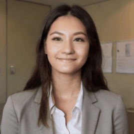
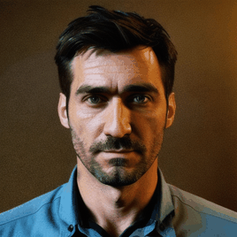
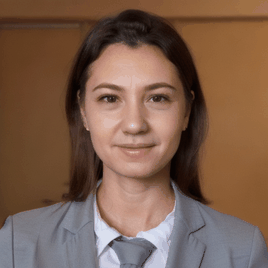

# AvatarGen: Realistic HR Manager Dynamic Avatar Generator

This project generates high-quality, professional dynamic avatar GIFs for male and female 'HR Manager' characters using Stable Diffusion and AnimateDiff.

## Features
- **Realistic Style**: Focused on professional, formal attire and corporate office settings.
- **Auto-Resize**: Generates at 512x512 and automatically downscales to **268x268** for optimal avatar performance.
- **Changeable prompt**: You can modify the prompt to suit your needs.

## Showcase

| Male Avatars | Female Avatars |
| :---: | :---: |
|  |  |
|  |  |

## Quick Start

1. **Installation**:
   ```bash
   pip install -r requirements.txt
   ```

2. **Generate**:
   ```bash
   python generate_avatar.py --gender male
   python generate_avatar.py --gender female
   ```

## Configuration
Modify `configs/prompts.yaml` to adjust the resolution, FPS, and prompt details.
